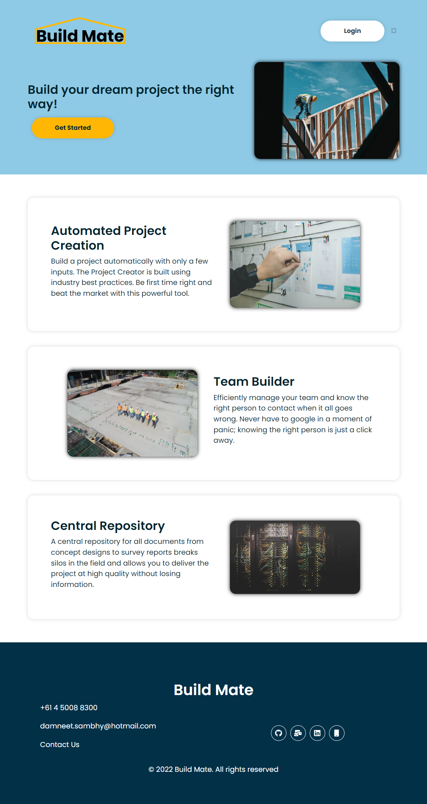
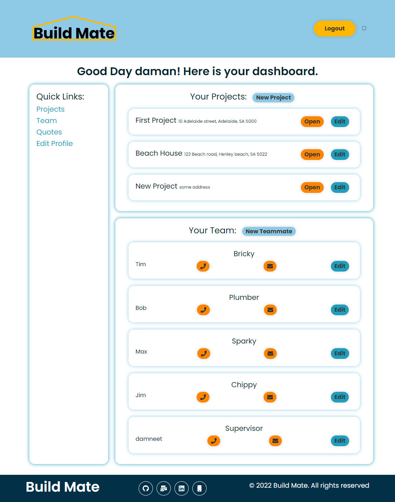
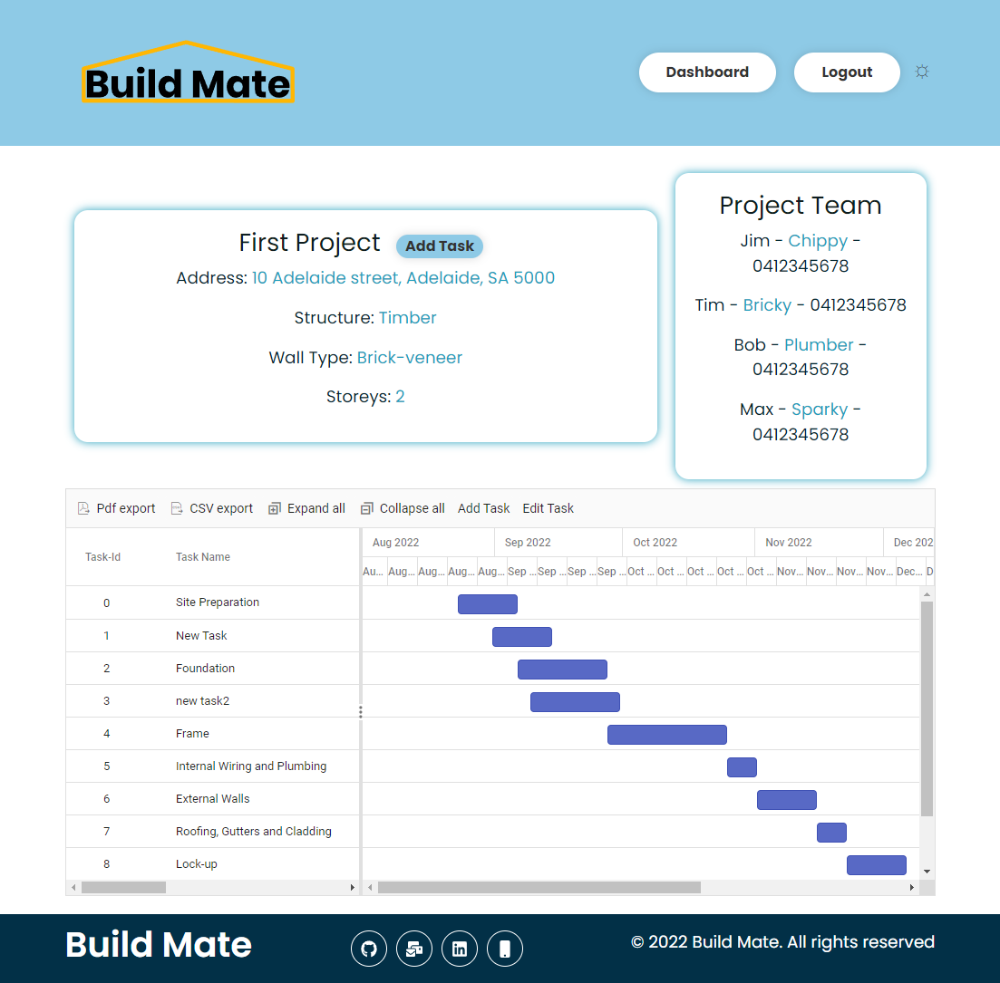

# build-mate


## Description
A construction management app for residential projects to help small builders to compete in todays market. Build Mate is providing users automated project creation, team builder and central repository for all project related assets. It allows the users to use tools with industry best-practices in-built.

Technologies Used:
- MERN Stack
- Styled Components
- Syncfusion
- GraphQL
- JWT


## Table of Contents
1. [Installation](#installation)
2. [Usage](#usage)
3. [License](#license)
4. [Contributing](#contributing)
5. [Tests](#tests)
6. [Questions](#questions)

## Installation
- To install the application locally please follow the instructions below.
```bash
- git clone git@github.com:daman29/build-mate.git
- npm install
```
- Then run the server and build the client using
```bash
- npm run develop
```


## Usage
- Run the application locally in dev mode with the following command:
```bash
- npm run develop
```
- Then visit [localhost:3000](localhost:3000) to use the app or [Click on this link](https://build-mate-damneet.herokuapp.com/) to visit the live application on Heroku.

- Visit the application repository at [GitHub Repository](https://github.com/daman29/build-mate)

The image below shows how the application looks.




The image below shows how the dashboard looks.



The image below shows how the project page looks like.



## License
- This application is licensed under the [MIT License](./LICENSE)

## Contributing
- Clone repository first using git clone
- Contribute your changes to a new branch

## Tests
- No test commands

## Questions
- Reach me via email at damneet.sambhy@hotmail.com or issues on [github](https://github.com/daman29)